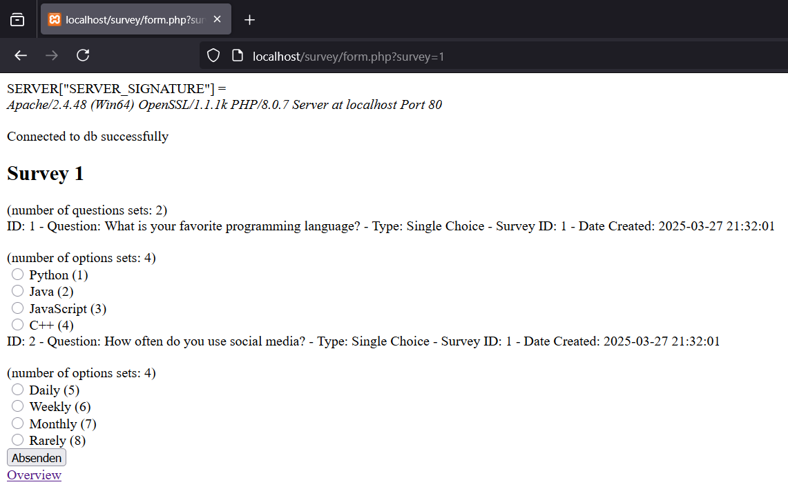

# Umfrage - Webseite mit PHP

## Aufgabe

Erstelle eine Webseite, welche es dem User ermöglicht, eine Umfrage durchzuführen.

Der Zweck besteht darin, an Informationen von Besuchern zu gelangen und diese dauerhaft speichern.

Neben den eigentlichen Sinn von Umfragen, etwas über die Qualität des Produktes zu erfahren bzw. die Meinung zu bestimmten Ereignissen zu erfragen, werden sie verwendet, um die Persönlichkeit vom Nutzer zu erfahren.

## Anforderungen

- Einzelne Fragen sollen zu einer Umfrage zusammengefügt werden.
- Der User soll die eingegebenen Daten als eine Bestätigung angezeigt bekommen.
- Die Antworten aus den Umfragen sollen persistiert werden, inklusive eines Zeitstempels.
- Die Anzahl der Fragen je Umfrage soll dynamisch änderbar sein.

## Technische Anforderungen

- **Frontend**: HTML, CSS, JavaScript
- **Backend**: PHP
- **Datenbank**: SQL Datenbank zur Speicherung der Umfragen und Antwortdaten

## Setup
- XAMPP PHP + MySQL

